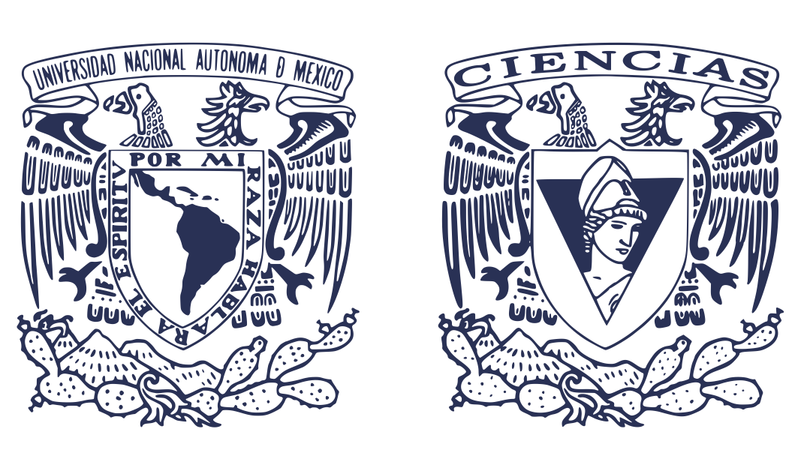
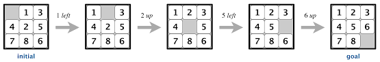

# Tarea de Inteligencia Artificial




Por:
* Almeida Rodriguez Jeronimo
* Hernandez Alonso Diana Berenice
* Jaramillo Ramirez Yonathan Berith
* Pérez Jacome David
* Torres Escobedo Julio Cesar  
Mexico, CDMX.

<br>Lenguaje de programacion: Python 3.10.6<br />
Descripcion: Implementacion Depth-First Search para resolver el 8 puzzle game.

# Depth-First Saearch algoritmo para resolver 8 PUZZLE 


## 1. 8 Puzzle game



El juego de 8-puzzle es un tablero de 3x3 piezas deslizables donde cada cuadro tiene un numero, asi todos estan numerados hasta llegar a el 8, los cuadros se encuentran en un orden random con un cuadro faltante, por ende uno debe ir deslizando hasta encontrar el orden correcto

## 2. Depth-First Search

Es un algoritmo para hacer busquedas en estructuras de datos como un arbol o bien un grafo, comienza en la rama raiz (o bien en algun nodo arbitrario si es el caso de un grafo) y explora tan lejos como es posible en cada rama antes de hacer backtracking.

Para mas informacion visitar los siguientes links

Link: wikipedia ->  https://en.wikipedia.org/wiki/Depth-first_search

Link: wikipedia -> https://en.wikipedia.org/wiki/Backtracking

## 3. Adicionales

Como adicional, implementamos un metodo donde regresa True si el puzzle tiene solucion. En caso contrario no existira una solucion y regresaremos que no existe solucion para este puzzle. Este metodo se baso teoricamente en el siguiente link:

Link: https://www.geeksforgeeks.org/check-instance-8-puzzle-solvable/

Aparte nuestro codigo solo soporta extender como maximo un total de 181440 nodos. Hicimos la prueba con el estado inicial que previamente fue dado:

[1,0,2]
[6,3,4]
[7,5,8]

Y no tiene solucion, pero anexamos ejemplos de los cuales si tiene solucion.

## 4. Datos de entrada del programa

Ejecutar python3 via comand prompt:

```sh
python3 main.py 'Estado del tablero inicial'
```
 El estado del tablero inicial  es con lo que se va a inicar a correr el algoritmo para encontrar el mejor camino

Ejemplo dfs:

```sh
python3 main.py 2,4,8,7,3,5,1,6,0
```

```sh
python3 main.py 0,1,2,3,4,5,6,7,8
```

## 5. Reporte de resultados

Se imprimiran en la terminal las acciones realizadas por el agente para resolver el problema

```sh
\ai\AI-8PuzzleAlgorithm>python3 main.py 1,0,2,6,3,4,7,5,8
```
Movimientos a seguir: Mostraremos una lista de movimientos 
Nodos expandidos:  El total de los nodos expandidos que se ejecuto en el codigo
Profundidad Nodo: La profundidad en la que se encuentra nuestro nodo meta
Profundidad Maxima: La profundidad maxima que recorrio el nodo
running_time: El tiempo que tardo el algoritmo en hallar el nodo meta
```

